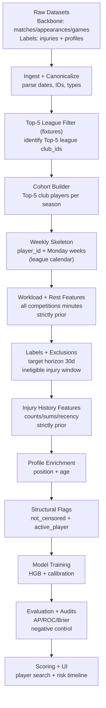
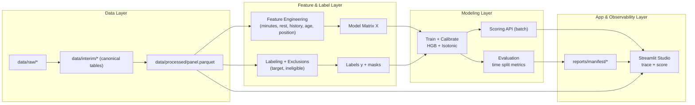
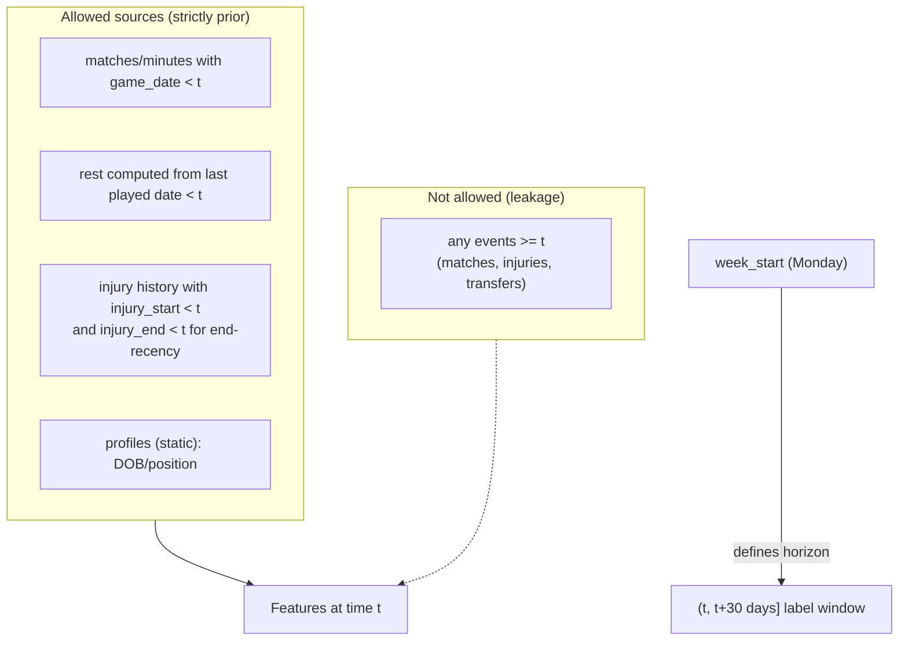

# Architecture Framework Design (Planning Document)

This document presents the **planned architecture framework** for an injury‑risk prediction system aligned with the assignment brief. It is written **as if we are in the planning phase** (before implementation), but it is intentionally consistent with the approach that was later built in this repo.

---

## 0) Problem framing (what we are building and why)

### Objective
Predict, for each **player-week** row `(player_id, week_start)`, whether a **time‑loss injury (≥7 days)** will **start in the next 30 days**.

### Primary constraints (assignment-driven)
We constrain the model to use only the selected feature groups:
1. **Age**
2. **Player position**
3. **Minutes played** (workload proxy)
4. **Days since last played** (rest proxy)
5. **Injury history** (strictly prior)

### Scope rule (Top‑5 leagues + all competitions)
- The **player cohort** is defined by **Top‑5 league club affiliation** (Premier League, LaLiga, Bundesliga, Serie A, Ligue 1).
- For in-scope players, we incorporate **all competitions** they participate in (domestic cups, European competitions, international fixtures) when computing workload/rest, because those minutes contribute to injury risk.

### Core design principles
- **No leakage:** every feature must be computed strictly from events **before** `week_start`.
- **Time-aware evaluation:** train/validation/test splits must be **chronological**, not random.
- **Observability:** every stage writes artifacts (schemas, coverage, missingness, metrics) so the pipeline is auditable.
- **Reproducibility:** the entire run can be reproduced from raw datasets with documented steps, fixed seeds, and versioned code.

---

## 1) Proposed end-to-end architecture (high level)

### 1.1 Logical stages (sequential steps)
1. **Data acquisition** (raw datasets)
2. **Ingestion + canonicalization** (consistent schemas and datatypes)
3. **Cohort definition** (Top‑5 club players)
4. **Weekly index construction** (player-week skeleton)
5. **Label generation + exclusions** (target + ineligible flags)
6. **Feature engineering** (only the approved feature groups)
7. **Quality gates + audits** (coverage, leakage, sanity)
8. **Model training + calibration** (baseline tabular model)
9. **Evaluation + reporting** (ranking + calibration + segmentation)
10. **Scoring + inspection UI** (player tracing, probability timelines)

### 1.2 Components (system-level view)
The architecture is organized into four layers:
- **Data layer:** raw datasets, canonical “interim” tables, final panel table
- **Feature/label layer:** deterministic feature engineering and target creation
- **Modeling layer:** training, calibration, evaluation, importance/explainability
- **Application/observability layer:** dashboards, tracing, artifacts, audits

---

## 2) Architecture diagrams (renderable)

### 2.1 Pipeline flow (end-to-end)

### 2.2 Component architecture (what talks to what)

### 2.3 Leakage boundary diagram (strictly prior)

**How to render diagrams**
- GitHub and many Markdown viewers render Mermaid blocks automatically.
- In VS Code, install a Mermaid preview extension, or use the built-in Markdown preview if it supports Mermaid.

---

## 3) Detailed architecture breakdown (with justifications)

### 3.1 Data acquisition (Data layer)
**Inputs**
- Backbone match participation and minutes (appearances + games metadata)
- Injury labels dataset (injury start/end + days_out)
- Player profiles (DOB, position)

**Design choices**
- Use a “backbone” registry for stable `player_id` keys; all tables join through `player_id`.
- Prefer datasets with **explicit injury windows** (`injury_start`, `injury_end`, `days_out`) to support both labels and exclusion masking.

**Risks and mitigations**
- *Risk:* player identity mismatch across sources → reduced join coverage.
  - *Mitigation:* track overlap coverage and implement a hard “overlap gate” (see 3.7).

### 3.2 Ingestion + canonicalization
**Goal**
Normalize and validate raw datasets so downstream steps are deterministic.

**Canonicalization tasks**
- Parse dates (`game_date`, `injury_start`, `injury_end`, `date_of_birth`)
- Enforce numeric types for `minutes_played`, `days_out`
- Drop obviously invalid rows (e.g., injury_end < injury_start)
- Deduplicate injury records (keep max severity for same player+start)

**Justification**
If date parsing or dtype coercion is inconsistent, the entire “strictly prior” guarantee can be violated silently.

### 3.3 Cohort definition (Top‑5 league club players)
**Requirement**
Main focus is Top‑5 leagues, but workload must include all competitions for those players.

**Proposed cohort rule**
A player is in-scope in a given season if they are affiliated with a club that participates in a Top‑5 league that season.

**Implementation strategy (conceptual)**
1. Identify Top‑5 league fixtures and extract club_ids (home and away).
2. Build a season‑level mapping `(season, club_id) → Top‑5 league competition_id`.
3. For each appearance, assign the player a Top‑5 league based on:
   - `player_club_id` (match club) if available, else
   - `player_current_club_id` (fallback for internationals)
4. For each `(player_id, season)`, select a **primary Top‑5 league** by minutes (largest total).

**Justification**
- Fixes “player-week duplication” and “ambiguous league” issues caused by mixed-competition participation.
- Keeps the panel’s `competition_id` interpretable (always Top‑5), while allowing all-competition minutes to influence risk.

### 3.4 Weekly index construction (player-week skeleton)
**Goal**
Create a stable prediction index: one row per player per week.

**Week definition**
- `week_start` = Monday of the week containing each match date.

**Calendar logic**
Use the Top‑5 league’s seasonal calendar boundaries (min/max week_start of league fixtures) to generate all Mondays for each league season, then cross-join to player-season cohorts.

**Justification**
This produces a consistent weekly timeline aligned to league seasons (and avoids missing weeks that appear “random” to end users).

### 3.5 Label generation + exclusions (target + ineligible)
**Label definition**
For each player-week `(player_id, t=week_start)`:
- `target = 1` if there exists a serious injury (days_out ≥ 7) with:
  - `injury_start ∈ (t, t + 30 days]`
- else `target = 0`

**Exclusion definition**
- `ineligible = 1` if `t ∈ [injury_start, injury_end]` (player already injured at prediction time)

**Why exclusions exist**
This prevents the model from “predicting injuries for already-injured players”, which is a different task (return-to-play risk).

### 3.6 Feature engineering (constrained feature set)
All features must be computable **strictly prior** to `week_start`.

#### A) Age
- Compute from `date_of_birth` and `week_start` as a continuous value.
- **Risk:** missing DOB creates “age=0” if naively filled.
- **Mitigation:** (planning) impute with median + add a missingness flag; ensure downstream uses consistent policy.

#### B) Player position
- Use position from profiles and one-hot encode to `pos_*` columns.
- **Risk:** missing/unknown positions become all-zero.
- **Mitigation:** (planning) create explicit “Unknown” bucket.

#### C) Minutes played (workload proxy)
- Use all competitions minutes from appearances.
- Compute rolling window totals; minimum required window: last 4 weeks (`minutes_last_4w`).
- **Strictly prior:** include only matches with `game_date < week_start`.

#### D) Days since last played (rest proxy)
- Compute `days_since_last_played` as days since most recent `game_date < week_start` where `minutes_played > 0`.
- Use a sentinel (e.g., 9999) for “no prior match found in history”.
- **Risk:** sentinel conflates “unknown” and “very long layoff”.
- **Mitigation:** (planning) add a boolean `has_prior_match` indicator.

#### E) Injury history
Strictly prior windows based on `injury_start`:
- `injuries_last_365d` (count)
- `days_out_last_365d` (sum)
- `days_since_last_injury_start`, `days_since_last_injury_end`, `last_injury_days_out`

**Justification for constrained features**
These features align with the assignment’s intended causal drivers: exposure (minutes), recovery (rest), vulnerability (history), and baseline heterogeneity (age/position).

### 3.7 Quality gates, audits, and observability
**Why we need this**
Sports injury prediction is extremely sensitive to subtle leakage and join issues. Without audits, strong-looking metrics can be invalid.

**Planned checks**
- **Overlap gate:** ensure a minimum intersection between cohort players and label players.
- **Label horizon audit:** verify `target==1` implies injury starts in 1..30 days.
- **Ineligible audit:** verify `ineligible==1` implies week is inside injury window.
- **Rolling feature spot-check:** recompute minutes features on a random sample from raw tables.
- **Negative control:** shuffle labels; AP should return to baseline prevalence.

**Artifacts**
Write structured outputs under:
- `reports/manifest/` (JSON/CSV: metrics, feature lists, audits)
- `reports/samples/` (examples and trace samples)
- `reports/figures/` (importance plots, timelines)

### 3.8 Model training + calibration
**Chosen baseline model**
- `HistGradientBoostingClassifier` for tabular, non-linear interactions.
- **Calibration:** Isotonic Regression on a validation split to produce more meaningful probabilities.

**Time-based split**
Train/valid/test must follow time to avoid “future” contamination.

**Justification**
Gradient boosting is a strong baseline for tabular data and is fast enough to iterate while the data/panel design stabilizes.

### 3.9 Evaluation design
**What “good” means**
Injury prediction is low signal-to-noise, so we evaluate:
- **Ranking quality:** Average Precision (PR-AUC), ROC-AUC
- **Alert usefulness:** Precision@TopK% and Recall@TopK%
- **Probability quality:** Brier score and calibration summaries
- **Robustness:** segmented metrics by league/season/position

**Interpretation guidance**
- Use the model as a **triage/ranking** system, not as a medical probability estimator.

### 3.10 Scoring + inspection UI (deployment-lite)
**Purpose**
Make the pipeline explainable to non-technical stakeholders:
- search players by name/id
- show weekly probabilities
- show the feature values used to generate those probabilities
- trace the player’s timeline and injury events

**Why a UI is part of the architecture**
For assignment purposes, it demonstrates that the system is inspectable and that “architecture” includes not just modeling, but operational use and verification.

---

## 4) Efficiency and scalability considerations (planning)

### 4.1 Performance concerns
- Player-week panel can be large (million+ rows).
- Feature engineering must avoid O(N×M) loops.

### 4.2 Planned optimizations
- Use vectorized operations and grouped computations.
- Use DuckDB for interactive filtering/aggregation without loading full parquet into memory.
- Cache trained models and computed artifacts in the UI to prevent retraining on every rerun.

---

## 5) Known failure modes (and how architecture addresses them)

1. **Week “gaps” that look like missing data**
   - Often caused by exclusion logic (`ineligible=1`), not missing panel rows.
   - Addressed by: including flags in UI, explicit option to show ineligible weeks, and audits.

2. **Ambiguous league context**
   - Occurs when a player plays multiple competitions in a week.
   - Addressed by: cohort builder assigns a primary Top‑5 league per player-season (minutes-based).

3. **Silent leakage**
   - Occurs if features accidentally include events ≥ `week_start`.
   - Addressed by: strict prior definitions, recomputation audits, negative control.

4. **Identity coverage drops**
   - Join coverage between injuries and backbone changes.
   - Addressed by: overlap gate and join stats artifacts.

---

## 6) Deliverables checklist (what we would commit in the planning phase)

- Architecture document (this file) + diagrams
- Explicit label definition + leakage constraints
- Feature dictionary (allowed vs disallowed)
- Pipeline runbook (commands and artifacts)
- Evaluation plan (metrics, splits, sanity checks)
- Risk register (failure modes + mitigations)

