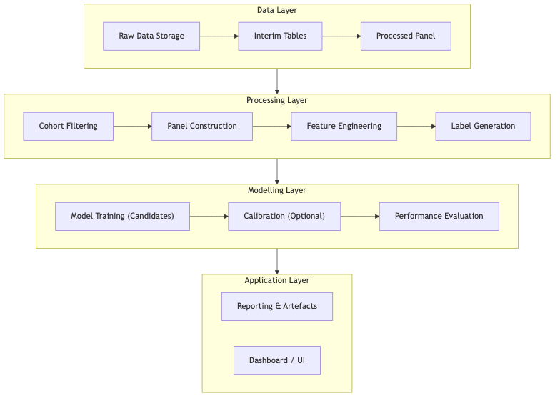
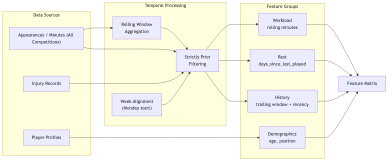

# Part 2: Architecture Framework Design

---

## Introduction

This report presents the planned architecture framework for an injury‑risk prediction system for football (soccer), written as if the project is still at the design stage. The framework breaks the solution into logical, sequential steps; identifies the key components needed; organises those components into a cohesive and efficient structure; and provides clear explanations and justifications for each design choice. The design emphasises reproducibility and auditability (for example, consistent data contracts, recorded run artefacts, and explicit quality gates), which are widely recommended when building applied machine‑learning systems (Huyen, 2022; Bullock et al., 2024).

The system is scoped to a cohort defined by Top‑5 European league club affiliation (EPL, La Liga, Bundesliga, Serie A, Ligue 1). However, once a player is in scope, the architecture intentionally treats **all competitions** (league, domestic cups, European competitions, and international fixtures) as relevant exposure when computing workload and rest, because fixture congestion and recovery constraints can be driven by matches outside league play (Page et al., 2023). This scope definition aligns the data representation with the real‑world training and match demands experienced by players.

---

## 1. Sequential Breakdown of the Proposed Solution

At a high level, the proposed solution converts raw match participation and injury records into a weekly player‑indexed dataset (a “player‑week panel”), then trains and evaluates candidate models to produce risk outputs for each player‑week. The sequential breakdown below defines each stage by its purpose, its main inputs, and its outputs.

First, the system ingests and standardises the raw sources: an appearances/workload backbone (match date and minutes played per player), player profile data (date of birth, primary position, and stable identifiers), and injury records (injury start/end dates and, where available, severity metadata). During ingestion, the architecture enforces consistent typing and date parsing, and it writes a minimal data quality summary (for example, row counts, missingness, and date ranges) so downstream stages can rely on a stable schema.

Second, the cohort is defined and filtered. In this project, the cohort is anchored to players contracted to clubs in the Top‑5 leagues during the relevant seasons. The cohort filter’s output is a list of in‑scope players (and their club context by season), plus their full match exposure across all competitions. This stage is also where the project’s scope rule is enforced: the “in scope” decision is made using Top‑5 club affiliation, but exposure is retained from all competitions for in‑scope players (Page et al., 2023).

Third, the prediction index is constructed as a weekly panel. Rather than predicting only on match days (irregular) or daily (highly sparse), the architecture uses a weekly cadence with a single, explicit definition of week boundaries: weeks start on Monday at 00:00. For each in‑scope player, the panel builder generates one row per `(player_id, week_start)` across the season range. This panel skeleton becomes the consistent time grid on which both features and labels are computed.

Fourth, feature engineering populates the panel skeleton with predictor variables. A non‑negotiable rule in the architecture is **temporal integrity**: every feature for a given `week_start` must be computed strictly from information dated **before** that `week_start`. This strict “prior‑only” constraint reduces the risk of leakage and makes the evaluation representative of real deployment (Kapoor & Narayanan, 2022). Feature engineering is intentionally modular, with separate computations for demographics (age, position), workload (rolling minutes played), rest (days since last match), and injury history (trailing‑window indicators). These groups are selected because soccer injury risk is multifactorial and depends on both intrinsic and extrinsic factors; umbrella evidence syntheses identify prior injury, exposure/load, and contextual factors as recurring elements in injury risk profiles (Genovesi et al., 2025).

Fifth, labeling and eligibility rules produce the target and the masks that define which rows are valid for training and evaluation. The planned target is a binary label per player‑week: `y = 1` if a time‑loss injury begins within the next 30 days after `week_start`, and `y = 0` otherwise when that future window is fully observable. To avoid teaching the model to “predict” an already‑active injury, the architecture marks player‑weeks as ineligible if the player is already injured at `week_start`. It also flags right‑censored rows near the end of the dataset where the full 30‑day horizon cannot be observed. For consistent operational definitions of time‑loss injury recording and reporting, the architecture is designed to follow football‑specific injury surveillance guidance (Waldén et al., 2023).

Finally, the modelling and evaluation stage trains candidate model families and measures performance under a consistent protocol. Because this is Part 2 (architecture), the key design requirement is not to pick one “best” model in advance, but to build an evaluation harness that supports fair comparison: a single feature set, a single eligibility mask, and a time‑based split that trains on earlier periods and evaluates on later periods to reflect forward‑in‑time usage (Hyndman & Athanasopoulos, 2021). The expected outputs of this stage are risk scores (or calibrated probabilities if needed), plus a concise evaluation report suitable for the dashboard and the final submission.

---

## 2. Key Components Needed in the Architecture Framework

The architecture decomposes into a small set of components, each responsible for one clear function and each producing an output that can be validated independently. The data loader component reads raw files, parses dates, validates required columns, and standardises types. The cohort filter component applies the Top‑5 club inclusion rule and returns the list of in‑scope players together with their exposure records across all competitions. The panel builder component creates the weekly player‑week skeleton using the system’s single week definition (Monday week start) and ensures coverage across the season range.

Feature engineering is implemented as a collection of feature modules that attach columns to the panel skeleton. Demographic features compute age at `week_start` and encode position. Workload features aggregate minutes played in rolling windows (for example, the previous four weeks) and are computed from appearances dated strictly before `week_start`. Rest features compute days since the last match date prior to `week_start`. Injury history features compute trailing‑window counts and recency measures based on prior injuries only, reflecting the repeated observation in soccer injury research that risk profiles depend on multiple interacting factors, including previous injury and exposure history (Genovesi et al., 2025).

The label and eligibility component generates the 30‑day target and creates eligibility masks for ineligible and right‑censored rows. The quality gate component checks invariants before modelling; for example, it verifies that key joins have adequate overlap, that week alignment is consistent, and that strict prior‑only rules have not been violated. The modelling and evaluation component performs the time‑based split, trains candidate models, optionally calibrates probabilities if the output is intended to be interpreted as a probability rather than a ranking, and computes performance metrics. Finally, the reporting and UI component exports run artefacts and model outputs into formats suitable for the Streamlit dashboard and the coursework submission.

---

## 3. Organising Components into a Cohesive, Efficient Structure

### 3.1 Layered architecture

To keep responsibilities separated and reduce coupling, the proposed framework uses a layered structure. The data layer stores raw inputs and interim tables, which makes it possible to audit intermediate outputs without rerunning the whole pipeline. The processing layer performs cohort filtering, panel construction, feature engineering, and labeling. The modelling layer consumes the processed panel and produces fitted model artefacts, plus evaluation summaries. The application layer consumes evaluation outputs and produces reports and a user‑facing dashboard.

**Figure 1.** Layer-based architecture showing the four main layers and the flow of data through the system.

### 3.2 Observability and reproducibility artefacts

Even in a coursework setting, the architecture benefits from minimal run artefacts that make it reproducible and easier to debug. The proposed artefacts include a run manifest (date ranges, cohort size, and split ranges), join and coverage diagnostics (who dropped at each stage and why), a panel schema and missingness summary, a recorded feature list used for modelling, and an evaluation summary that captures metrics and the chosen operating point. This design also supports clearer reporting and aligns with calls for more transparent and open practices in sports and exercise medicine research (Bullock et al., 2024).

### 3.3 Quality gates

Quality gates are included because injury prediction pipelines can appear to run successfully even when subtle errors occur, such as a join mismatch that silently reduces cohort coverage or a week alignment mistake that shifts features into the future. The architecture therefore plans for explicit checks that halt execution and produce diagnostics if critical invariants fail. In particular, the design treats strict temporal integrity as a hard requirement, since leakage is a well‑documented driver of non‑reproducible results in ML‑based science (Kapoor & Narayanan, 2022).

---

## 4. Integration of Selected Features with Problem Objectives

The problem objective is to identify players at elevated risk of a time‑loss injury within a 30‑day horizon. The selected feature set is integrated into the architecture because it provides a practical and interpretable description of the main factors the data can observe: match exposure, recovery, susceptibility, and baseline context. Workload is operationalised through rolling minutes played, which serves as a match exposure proxy and captures periods of high match density that can reduce recovery time (Page et al., 2023). Rest is represented as days since the last match, capturing the immediate recovery context entering each prediction week. Injury history is represented through trailing‑window indicators and recency, reflecting the broader evidence that injury risk profiles incorporate prior injury and other intrinsic/extrinsic factors in combination (Genovesi et al., 2025). Age and position provide stable demographic and role context.

Critically, the architecture enforces that these features are computed on a consistent weekly grid and only from strictly prior information, ensuring that the evaluation reflects a realistic “predict forward in time” setting rather than an artefact of data leakage.

---

## 5. Explanations and Justifications for Design Choices

Weekly granularity is chosen because it provides a regular time step that simplifies rolling‑window features and avoids the sparsity of daily panels and the irregular spacing of match‑based rows. In applied settings, weekly risk outputs are also easier to interpret in relation to training microcycles and fixture blocks, making the predictions more actionable.

The 30‑day horizon is chosen because it balances actionability and learnability. A very short horizon would reduce positive examples and increase label volatility, while a very long horizon would dilute the connection between recent workload/rest conditions and the target event. A 30‑day window also aligns with how clubs may plan load management and player availability across short fixture periods.

Chronological splitting is justified because the model is intended to be used prospectively. A time‑based evaluation protocol mimics the real use case of training on historical seasons and predicting future periods; it also avoids optimistic estimates that can occur when random splits mix future and past observations (Hyndman & Athanasopoulos, 2021). Finally, the strict prior‑only feature rule is justified because leakage is easy to introduce in sports datasets (for example, by including minutes played after `week_start`) and can severely bias evaluation; leakage is a known contributor to irreproducible ML results (Kapoor & Narayanan, 2022).

---

## 6. Visual Representation of the Architecture Framework

### 6.1 End-to-end flowchart

**Figure 2.** End-to-end pipeline flowchart showing the sequence of processing stages from raw data to final outputs.

### 6.2 Feature engineering pipeline diagram

**Figure 3.** Feature engineering pipeline showing how each feature group is computed under consistent time rules.

---

## Conclusion

This architecture framework provides a planning‑phase blueprint for an injury‑risk prediction system: it defines a clear set of sequential stages, identifies the core components needed at each stage, and organises those components into a layered structure that supports maintainability, reproducibility, and fair model evaluation. The design integrates the selected features (age, position, workload, rest, and injury history) with explicit temporal integrity rules and cohort scope constraints that reflect real match exposure across competitions.

---

## References (APA 7)

Bullock, G. S., Ward, P., Kluzek, S., Hughes, T., Shanley, E., Arundale, A. J. H., Ranson, C., Nimphius, S., Riley, R. D., Collins, G. S., & Impellizzeri, F. M. (2024). Paving the way for greater open science in sports and exercise medicine: Navigating the barriers to adopting open and accessible data practices. *British Journal of Sports Medicine, 58*(6), 293–295. https://doi.org/10.1136/bjsports-2023-107225

Genovesi, F., Tabone, M., Nuara, S., Pasquali, E., Rossi, A., Perali, A., & Bongiovanni, T. (2025). Injury risk profile for soccer players: Identification of the risk factors for soccer-related injuries—An umbrella review. *Research in Sports Medicine, 33*(4), 385–411. https://doi.org/10.1080/15438627.2025.2467867

Huyen, C. (2022). *Designing machine learning systems: An iterative process for production-ready applications*. O’Reilly Media.

Hyndman, R. J., & Athanasopoulos, G. (2021). *Forecasting: Principles and practice* (3rd ed.). OTexts. Retrieved February 6, 2026, from https://otexts.com/fpp3/

Kapoor, S., & Narayanan, A. (2022). Leakage and the reproducibility crisis in ML-based science (arXiv:2207.07048). *arXiv*. https://doi.org/10.48550/arXiv.2207.07048

Page, R. M., Field, A., Langley, B., Harper, L. D., & Julian, R. (2023). The effects of fixture congestion on injury in professional male soccer: A systematic review. *Sports Medicine, 53*(3), 667–685. https://doi.org/10.1007/s40279-022-01799-5

Waldén, M., Mountjoy, M., McCall, A., Serner, A., Massey, A., Tol, J. L., Bahr, R., D’Hooghe, M., Bittencourt, N., Della Villa, F., Dohi, M., Dupont, G., Fulcher, M., Janse van Rensburg, D. C., Lu, D., & Andersen, T. E. (2023). Football-specific extension of the IOC consensus statement: Methods for recording and reporting of epidemiological data on injury and illness in sport 2020. *British Journal of Sports Medicine, 57*(21), 1341–1350. https://doi.org/10.1136/bjsports-2022-106405

