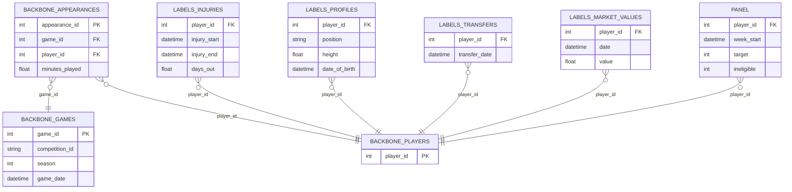

# Injury Risk Pipeline — Data & Model Guide (First‑Time Reader)

This document explains, in precise detail:
- Which datasets this repo uses and why
- The exact table structures (columns) for canonical inputs and outputs
- How joins happen (what matches, what doesn’t, and why)
- How the player‑week panel is built (including leakage constraints)
- What features exist today, what they mean, and what’s worth exploring next
- Which model is used, how it’s evaluated, how it performs, and what to improve
- A concrete lineage walkthrough for **Antoine Griezmann** (player_id **125781**) from matches → features → labels → risk

All factual numbers below (row counts, join coverage, metrics) are taken from the repo’s generated artifacts under `reports/manifest/` and `data/interim/` created by running the pipeline on **January 30, 2026**.

---

## 0) Project goal (what is being predicted?)

**Task:** For each `(player_id, week_start)` row, predict whether the player will have a **time‑loss injury (≥7 days)** that **starts in the next 30 days**.

Formally, for player *p* at week_start *t*:
- `target = 1` if ∃ injury with `injury_start ∈ (t, t + 30 days]` and `days_out ≥ 7`.
- `target = 0` otherwise.

Additionally, we exclude rows where the player is already injured at time *t*:
- `ineligible = 1` if `week_start ∈ [injury_start, injury_end]` (using the same ≥7 day injury set today).

Source of truth for label definitions: `src/data/processing.py` (`add_labels_and_exclusions`).

---

## 1) Quickstart (how to reproduce everything)

### Use the repo’s venv
This repo’s `make_panel.py` and all parquet writers require `pyarrow`. Your system `python3` may not have it; the repo venv does.

```bash
source .venv/bin/activate
```

### One‑shot runbook (writes all observability artifacts)
```bash
python inspect_raw.py
python make_panel.py
python verify_panel.py --panel data/processed/panel.parquet
python audit_eval.py --panel data/processed/panel.parquet
python inspect_panel.py
python inspect_joins.py
python quick_eval.py --panel data/processed/panel.parquet --print-manifest
python feature_report.py
python trace_player.py --player-id 125781  # Antoine Griezmann
```

### Streamlit UI (optional but recommended)
```bash
pip install -r requirements-ui.txt
streamlit run ui/app.py
```

---

## 2) Datasets used (what + where + why)

### 2.1 Backbone: match/appearance timeline (the “workload spine”)

**Dataset:** `davidcariboo/player-scores`  
**Local path:** `data/raw/davidcariboo:player-scores/`  
**Used for:**
- Match schedule and metadata (`games.csv`)
- Player match participation and minutes (`appearances.csv`)
- Player registry (IDs, names, DOB, etc.) (`players.csv`)
- Competition metadata (`competitions.csv`)

**Why this dataset?**
- It provides a consistent `player_id` and `game_id` spine, which is essential for **strictly‑prior** workload features.
- It includes minutes played and card counts, enabling workload + discipline proxies.

### 2.2 Labels + enrichment: injuries, profiles, transfers, market values

**Dataset:** `xfkzujqjvx97n/football-datasets`  
**Local path:** `data/raw/xfkzujqjvx97n:football-datasets/`  
**Used for:**
- Injury labels (start/end/days_out): `player_injuries/...`
- Player profiles (position, height, DOB, etc.): `player_profiles/...`
- Transfer history: `transfer_history/...`
- Market values over time: `player_market_value/...`

**Why this dataset?**
- Injury windows + days missed are provided directly (no name matching).
- Market value & transfers are time‑varying, enabling “as‑of” context features.

### 2.3 Optional backup label dataset (not used in main pipeline)

**Dataset:** `irrazional/transfermarkt-injuries`  
**Local path:** `data/raw/irrazional:transfermarkt-injuries.csv`  
**Intended use:** fallback injury source if label join coverage drops below the overlap gate threshold.

---

## 3) Canonical tables (what the pipeline actually loads and saves)

The pipeline saves a canonical “interim layer” to make joins inspectable:
- Folder: `data/interim/`
- Writer: `make_panel.py` (interim parquet writes happen immediately after loading/cleaning)

These are the **canonical tables** used for joins and lineage.

### 3.1 Backbone (from `davidcariboo/player-scores`)

#### `data/interim/backbone_appearances.parquet` (rows: 1,706,806; cols: 13)
Columns:
`appearance_id`, `game_id`, `player_id`, `player_club_id`, `player_current_club_id`, `date`, `player_name`, `competition_id`, `yellow_cards`, `red_cards`, `goals`, `assists`, `minutes_played`

Used for:
- Workload features: minutes over rolling windows (strictly prior)
- Congestion features: match counts, short-window minutes, max minutes
- Discipline: yellow/red card rollups

#### `data/interim/backbone_games.parquet` (rows: 74,026; cols: 23)
Columns:
`game_id`, `competition_id`, `season`, `round`, `game_date`, `home_club_id`, `away_club_id`, `home_club_goals`, `away_club_goals`, `home_club_position`, `away_club_position`, `home_club_manager_name`, `away_club_manager_name`, `stadium`, `attendance`, `referee`, `url`, `home_club_formation`, `away_club_formation`, `home_club_name`, `away_club_name`, `aggregate`, `competition_type`

Used for:
- Computing `week_start` (Monday of the match week)
- Determining `season` for activity windows
- Away/home inference for travel proxy features (via club IDs)

#### `data/interim/backbone_players.parquet` (rows: 32,601; cols: 23)
Columns:
`player_id`, `first_name`, `last_name`, `name`, `last_season`, `current_club_id`, `player_code`, `country_of_birth`, `city_of_birth`, `country_of_citizenship`, `date_of_birth`, `sub_position`, `position`, `foot`, `height_in_cm`, `contract_expiration_date`, `agent_name`, `image_url`, `url`, `current_club_domestic_competition_id`, `current_club_name`, `market_value_in_eur`, `highest_market_value_in_eur`

Used for:
- Name → `player_id` lookup (important for trace/debug)
- (Not currently merged into the panel; profile enrichment comes from labels dataset instead)

#### `data/interim/backbone_competitions.parquet` (rows: 44; cols: 11)
Columns:
`competition_id`, `competition_code`, `name`, `sub_type`, `type`, `country_id`, `country_name`, `domestic_league_code`, `confederation`, `url`, `is_major_national_league`

Used for:
- “Top‑5 leagues” filtering policy and verification reports

### 3.2 Labels + enrichment (from `xfkzujqjvx97n/football-datasets`)

#### `data/interim/labels_injuries.parquet` (rows: 142,592; cols: 7)
Columns:
`player_id`, `season_name`, `injury_reason`, `injury_start`, `injury_end`, `days_out`, `games_missed`

Used for:
- `target` creation (injury starts within 30d)
- `ineligible` exclusion (week inside injury window)
- Injury history features (counts/sums/recency)

#### `data/interim/labels_profiles.parquet` (rows: 92,671; cols: 34)
Key columns used today:
- `player_id`
- `position`
- `height`
- `date_of_birth`

Used for:
- `label_known` universe expansion (player exists in injuries OR profiles)
- Panel enrichment: `position`, `height`, `date_of_birth` → `age`

#### `data/interim/labels_transfers.parquet` (rows: 1,101,440; cols: 10)
Columns:
`player_id`, `season_name`, `transfer_date`, `from_team_id`, `from_team_name`, `to_team_id`, `to_team_name`, `transfer_type`, `value_at_transfer`, `transfer_fee`

Used for:
- `days_since_transfer` (as‑of latest transfer date)

#### `data/interim/labels_market_values.parquet` (rows: 901,429; cols: 3)
Columns:
`player_id`, `value`, `date`

Used for:
- `market_value` (as‑of)
- `market_value_6m` (as‑of 180 days ago)
- `log_market_value`, `market_value_trend`

---

## 4) Join graph and audit coverage (what matches, what doesn’t)

### 4.1 Join keys
- The **primary join key** is `player_id`.
- Backbone internal joins use:
  - `appearances.game_id → games.game_id`
  - `games.competition_id → competitions.competition_id`

### 4.2 Entity diagram (logical view)



### 4.3 Join audits (actual measured coverage)

The join audit script `inspect_joins.py` writes:
- `reports/manifest/join_stats.csv`
- `reports/samples/unmatched_backbone_players.csv`
- `reports/samples/unmatched_label_players.csv`
- plus per-join left/right unmatched samples.

Measured join coverage at the **player registry level** (left side = backbone players table):

| join | left_unique | right_unique | coverage_left |
|---|---:|---:|---:|
| players_vs_injuries | 32,601 | 34,554 | 0.5300 |
| players_vs_profiles | 32,601 | 92,671 | 0.7212 |
| players_vs_transfers | 32,601 | 117,944 | 0.8043 |
| players_vs_market_values | 32,601 | 69,441 | 0.7057 |

Interpretation:
- Injuries table has many players **not in the backbone player registry**, and the backbone registry has many players **with no injuries record** (which is expected: “healthy” players are legitimate negatives, but “missing from label universe” is different).
- Profiles / transfers / market values cover a larger share of backbone players.

### 4.4 The “Top‑5 overlap gate” (the pipeline’s hard stop)

The pipeline uses a stricter overlap gate on the **Top‑5 filtered player set** (not the full backbone registry).

Source: `reports/manifest/panel_build_manifest.json`

- Top‑5 unique players (backbone): **9,784**
- Label players (injuries): **34,554**
- Overlap: **80.06%** (**PASS**, threshold is 70%)

If overlap < 70%, `make_panel.py` aborts and suggests switching label source or adding ID mapping.

---

## 5) How the panel is built (pipeline stages)

The pipeline entrypoint is `make_panel.py`. Conceptually:

```mermaid
flowchart TD
  A[Load backbone tables] --> B[Filter Top-5 leagues]
  B --> C[Build player-week skeleton]
  C --> D[Workload features (rolling minutes)]
  D --> E[Congestion features (counts, short windows)]
  E --> F[Context features (transfers, market value)]
  F --> G[Labels + exclusions (injury window)]
  G --> H[Injury history (strictly prior)]
  H --> I[Profiles enrichment (height, position, age)]
  I --> J[Structural flags (not_censored, active_player)]
  J --> K[Save panel + manifests]
```

### 5.1 Stage A: Load backbone tables (`src/data/loader.py`)

`load_backbone()` loads:
- `appearances.csv` → parses `date` to datetime
- `games.csv` → parses `date`, then renames to `game_date`
- `players.csv`
- `competitions.csv`

### 5.2 Stage B: Filter to Top‑5 leagues (`src/data/processing.py:filter_top5`)

Top‑5 league IDs are inferred from competitions using:
- Preferred: `competition_id` or `competition_code` in `{GB1, ES1, L1, IT1, FR1}`
- Fallback: country + tier/type heuristics

Outputs:
- `games_top5` (rows: 23,159)
- `appearances_top5` (rows: 661,126)

### 5.3 Stage C: Build weekly skeleton (`src/data/processing.py:build_weekly_panel`)

Definition:
- `week_start` is computed as **Monday** of the match week:
  - `week_start = game_date - weekday(game_date)`
- The skeleton enumerates `(player_id, week_start)` for each player active in a `(competition_id, season)` window, using **full week ranges** between min/max weeks of that competition-season.

Important nuance:
- After generating chunks with `competition_id` and `season`, the code deduplicates to 1 row per `player_id, week_start`.
- If a player appears in multiple competition-seasons that produce the same `player_id, week_start`, the retained `competition_id/season` can be somewhat arbitrary (depends on concatenation order).
  - Workload features are computed from **all competitions**, so this does not break workload.
  - But it can affect any UI filtering by `competition_id` at the panel row level.
  - If league‑aware analysis is required, a follow‑up improvement is to define a deterministic “primary competition” per player-week (e.g., max minutes in that week).

Result:
- Panel skeleton rows: **1,360,063** (`reports/manifest/panel_build_manifest.json`)

### 5.4 Stage D: Workload features (`src/data/processing.py:add_workload_features`)

Data source:
- `backbone_appearances` (all competitions), joined with `games` for `game_date` if needed.

Leakage policy:
- Features are **strictly prior**: only matches with `game_date < week_start` contribute.
  - Implemented by computing rolling sums then shifting by 1 day (`shift(1)`).

Outputs (minutes rollups):
- `minutes_last_1w` = sum minutes in last 7 days
- `minutes_last_2w` = sum minutes in last 14 days
- `minutes_last_4w` = sum minutes in last 28 days
- `minutes_last_8w` = sum minutes in last 56 days
- `acwr` = `minutes_last_1w / (minutes_last_4w / 4 + 1)` (smoothed acute:chronic ratio)

### 5.5 Stage E: Congestion features (`src/data/processing.py:add_congestion_features`)

Derived from appearances (and optionally games for away inference):
- Match counts: `matches_last_3d`, `matches_last_7d`, `matches_last_14d`, `matches_last_28d`
- Short term load: `minutes_last_10d`
- Peak intensity: `max_minutes_14d`
- Travel proxies (if games join succeeds): `away_matches_last_28d`, `away_minutes_last_28d`, and derived `away_match_share_28d`
- Discipline proxies: `yellow_cards_last_28d`, `red_cards_last_56d`

All are strict prior (rolling then `shift(1)`).

### 5.6 Stage F: Context features (`src/data/processing.py:add_context_features`)

As‑of joins (Pandas `merge_asof`) keyed by `player_id` and dates:

Transfers:
- Finds the latest `transfer_date <= week_start` and computes:
  - `days_since_transfer` (capped/fill logic: missing → 3650)

Market values:
- Finds as‑of market value at `week_start`:
  - `market_value` (from `labels_market_values.value`)
- Finds as‑of market value at `week_start - 180 days`:
  - `market_value_6m`
- Adds:
  - `log_market_value = log1p(market_value)`
  - `market_value_trend = (market_value - market_value_6m) / (market_value_6m + 10000)`

### 5.7 Stage G: Labels + exclusions (`src/data/processing.py:add_labels_and_exclusions`)

Label universe:
- `label_known = 1` if player_id exists in **injuries** OR **profiles** (union).

Target:
- Use “serious” injuries: `days_out >= 7`
- For each panel row `(p, t)`:
  - `target = 1` if there is a serious injury with `injury_start ∈ (t, t+30d]`

Ineligible:
- Also uses the same serious injuries set:
  - `ineligible = 1` if `t ∈ [injury_start, injury_end]`

### 5.8 Stage H: Injury history features (`src/data/processing.py:add_injury_history_features`)

Strictly prior windows using `injury_start`:
- Counts:
  - `injuries_last_30d`, `injuries_last_180d`, `injuries_last_365d`
- Days-out sums:
  - `days_out_last_30d`, `days_out_last_180d`, `days_out_last_365d`
- Recency:
  - `days_since_last_injury_start`
  - `days_since_last_injury_end`
  - `last_injury_days_out`

Implementation uses numpy `searchsorted` for performance and enforces strict prior (`injury_start < t`).

### 5.9 Stage I: Profile enrichment (in `make_panel.py`)

`make_panel.py` merges a subset of profile fields into the panel:
- `height` (sanitized: unrealistic heights → NaN)
- `position`
- `date_of_birth`
- Derived:
  - `age = (week_start - date_of_birth).days / 365.25`

### 5.10 Stage J: Structural flags (`src/data/processing.py:add_structural_flags`)

Right censoring:
- `not_censored = 1` if `(week_start + 30 days) <= max(injury_start)`
  - Ensures the 30‑day label window is fully observable.

Active player window (Option A):
- For each `(player_id, season)`, compute:
  - `first_app` and `last_app` from appearances
  - active window = `[first_app - 14d, last_app + 14d]`
- `active_player = 1` if `week_start` is inside that window.

---

## 6) Panel schema (the model training table)

Panel location:
- `data/processed/panel.parquet`

Panel observability artifacts:
- `reports/manifest/panel_columns.csv` (full column list + dtypes)
- `reports/manifest/missingness.csv` (missingness + unique counts)
- `reports/samples/panel_sample_50k.parquet` (fast UI sample)

### 6.1 Panel row count and label stats
From `reports/manifest/panel_build_manifest.json`:
- Rows: **1,360,063**
- Players: **9,784**
- Positives (`target==1`): **90,159** (6.63%)
- Ineligible (`ineligible==1`): **117,325** (8.63%)

### 6.2 Exact panel columns (43)
Source: `reports/manifest/panel_columns.csv`

Keys:
- `player_id`
- `week_start`
- `competition_id`
- `season`

Workload:
- `minutes_last_1w`, `minutes_last_2w`, `minutes_last_4w`, `minutes_last_8w`, `acwr`

Congestion / travel / discipline:
- `matches_last_3d`, `matches_last_7d`, `matches_last_14d`, `matches_last_28d`
- `minutes_last_10d`, `max_minutes_14d`
- `away_matches_last_28d`, `away_minutes_last_28d`, `away_match_share_28d`
- `yellow_cards_last_28d`, `red_cards_last_56d`

Context:
- `days_since_transfer`
- `market_value`, `market_value_6m`, `log_market_value`, `market_value_trend`

Labels / flags:
- `label_known`
- `target`
- `ineligible`
- `not_censored`
- `active_player`

Injury history:
- `injuries_last_30d`, `injuries_last_180d`, `injuries_last_365d`
- `days_out_last_30d`, `days_out_last_180d`, `days_out_last_365d`
- `days_since_last_injury_start`, `days_since_last_injury_end`, `last_injury_days_out`

Demographics:
- `height`, `position`, `date_of_birth`, `age`

### 6.3 Missingness (what’s actually missing)
From `reports/manifest/missingness.csv`, the largest missingness is only in demographics:
- `height`: ~7.60% missing
- `age` / `date_of_birth`: ~6.30% missing
- `position`: ~6.24% missing

All other engineered features are filled (usually 0) and have 0% missingness.

---

## 7) Feature catalog + what to explore next

### 7.1 Catalog and importance artifacts
Generated by:
- `python feature_report.py`
- `python quick_eval.py --print-manifest`

Artifacts:
- `reports/manifest/feature_catalog.csv` (type, missingness, basic stats)
- `reports/manifest/model_features.csv` (the exact features used by `quick_eval.py`)
- `reports/manifest/feature_importance_validation.csv` (permutation importance on validation)
- `reports/figures/feature_missingness_top30.png`
- `reports/figures/feature_importance_top30.png`

### 7.2 Current “best” features (measured)
Top permutation importance features (validation) from `reports/manifest/feature_importance_validation.csv` are dominated by:
1. Injury history: `injuries_last_365d`
2. Recency: `days_since_last_injury_start`, `days_since_last_injury_end`
3. Demographics: `age`, `height`
4. Workload: `minutes_last_4w`, `minutes_last_1w`, `minutes_last_8w`
5. Position: several `pos_*` dummies (notably `pos_Goalkeeper`)

This is directionally sensible in the real world:
- Prior injuries and recent recovery are among the strongest predictors of future injury risk.
- Workload is a plausible contributing factor.
- Age is a well‑known risk factor.

### 7.3 Recommended feature work (next steps)

If you want a stronger model, prioritize:

**A) Better league/season semantics at the player-week level**
- Today, `competition_id` can be ambiguous due to deduplication.
- Improve by setting a deterministic “primary competition” per player-week (e.g., the competition with most minutes in that week).

**B) Stronger exposure proxies**
- Match importance and intensity proxies (derivable from backbone):
  - minutes in last N matches (not just last N days)
  - starts vs substitutions (if available in appearances schema in other versions)
  - goal involvement/role proxies (goals/assists per window)
- Rest/recovery proxies:
  - days since last match
  - min rest in last 14 days

**C) Injury type / body part segmentation (if available)**
- `injury_reason` exists in `labels_injuries.parquet`.
- You can stratify by injury type and build “type-specific history” features:
  - hamstring history, muscle injuries, etc.

**D) Team-level context (future)**
- Using `from_team_id`/`to_team_id` and game formations/manager fields:
  - managerial changes, formation instability
  - schedule congestion at team level (not just player)

**E) Reduce label noise**
- Some injury windows may have missing `injury_end` and are imputed in cleaning; that can affect ineligible logic.
- Consider excluding injuries with missing end dates (or model end uncertainty explicitly).

---

## 8) Model used (baseline) + evaluation protocol

### 8.1 The baseline model

`quick_eval.py` trains:
- `HistGradientBoostingClassifier` (scikit‑learn)
- Calibrates probabilities using `IsotonicRegression` on a validation split

Why this model?
- Strong baseline for tabular data
- Captures non‑linear relationships
- Trains fast enough to iterate

### 8.2 Train/valid/test split (time-based)

In `quick_eval.py` (and mirrored in `audit_eval.py`):
- Train: `week_start < 2023-06-01`
- Valid: `2023-06-01 <= week_start < 2024-01-01`
- Test: `week_start >= 2024-01-01`

This is important: it avoids training on “future” rows.

### 8.3 The strict training mask (which rows are eligible for modeling)

Both `quick_eval.py` and `audit_eval.py` use:
- `ineligible == 0`
- `not_censored == 1`
- `active_player == 1`
- and if present: `label_known == 1`

This mask defines the dataset the model actually sees.

### 8.4 Performance (measured)

From `reports/manifest/eval_manifest.json` (test set is `week_start >= 2024-01-01`):
- Test prevalence: **0.0989**
- Average Precision (AP): **0.1505**
- ROC‑AUC: **0.6377**
- Brier score: **0.0873**
- Precision@Top5%: **0.1948**
- Recall@Top5%: **0.0985**

Interpretation:
- AP is above prevalence, meaning the model concentrates positives somewhat better than random ranking.
- Precision@Top5% is ~19.5% vs baseline prevalence ~9.9%: the top alerts are enriched for positives, but still noisy (as expected for injury risk).

### 8.5 Sanity audits (leakage + label correctness)

`verify_panel.py` and `audit_eval.py` run audits including:
- Target horizon check: `target==1` implies an injury starts in 1..30 days
- Ineligible window check: `ineligible==1` implies week inside injury window
- Rolling workload recomputation spot-check (strict prior)
- Negative control (label shuffling) in `audit_eval.py`

Primary artifact:
- `reports/manifest/audit_results.json`

---

## 9) Player lineage walkthrough (Antoine Griezmann)

### 9.1 Find his `player_id`

`player_id` comes from the backbone registry (`backbone_players.parquet`).

Example lookup:
```python
import pandas as pd
players = pd.read_parquet('data/interim/backbone_players.parquet')
players[players['name'].str.contains('Griezmann', case=False, na=False)][['player_id','name']].head()
```

This pipeline run finds:
- **Antoine Griezmann → player_id = 125781**

### 9.2 Generate and inspect his trace

Command:
```bash
python trace_player.py --player-id 125781
```

Outputs:
- Timeline HTML: `reports/html/player_125781_timeline.html`
- Timeline PNG: `reports/figures/player_125781_timeline.png`
- Panel rows: `reports/samples/player_125781_panel_rows.csv`
- Matches: `reports/samples/player_125781_matches.csv`
- Injuries: `reports/samples/player_125781_injuries.csv`

What to look for:
- Workload curve (minutes rollups)
- Injury windows (shaded spans)
- `target==1` markers around injury starts

### 9.3 How his rows are assembled (lineage)

For Griezmann (and any player), a single panel row is computed from:

1) **Skeleton row**: `(player_id, week_start)` created by `build_weekly_panel` from Top‑5 competition-season activity.
2) **Workload**: minutes rollups from `backbone_appearances` strictly prior to week_start.
3) **Context**: as‑of transfer and market value from labels tables.
4) **Label**:
   - `target`: any serious injury starting in `(t, t+30]`
   - `ineligible`: week inside serious injury window
5) **History**: strictly‑prior injury counts/sums/recency.
6) **Flags**:
   - `not_censored`: label window fully observed
   - `active_player`: inside season activity window

### 9.4 Example: “How does the model predict for him?”

The baseline evaluation script does not persist per-row scores. But you can reproduce the `quick_eval.py` model in a notebook/script and score any player-week rows.

Below is an *actual* scoring snapshot for Griezmann from this run, using the same model family and feature set as `quick_eval.py` (trained on train period, calibrated on valid period).

**Last 15 strict rows in the test period:**
```
 player_id week_start  target  minutes_last_4w  injuries_last_365d  days_since_last_injury_start  pred_risk
    125781 2024-12-30       0            299.0                   1                           313   0.141892
    125781 2025-01-06       0            299.0                   1                           320   0.158462
    125781 2025-01-13       0            253.0                   1                           327   0.145251
    125781 2025-01-20       0            270.0                   1                           334   0.139411
    125781 2025-01-27       0            388.0                   1                           341   0.139411
    125781 2025-02-03       0            394.0                   1                           348   0.130389
    125781 2025-02-10       0            467.0                   1                           355   0.124169
    125781 2025-02-17       0            455.0                   1                           362   0.112240
    125781 2025-02-24       0            405.0                   0                           369   0.112240
    125781 2025-03-03       0            440.0                   0                           376   0.100655
    125781 2025-03-10       0            417.0                   0                           383   0.100655
    125781 2025-03-17       0            514.0                   0                           390   0.097168
    125781 2025-03-24       0            446.0                   0                           397   0.097168
    125781 2025-03-31       0            405.0                   0                           404   0.112240
    125781 2025-04-07       0            402.0                   0                           411   0.112240
```

How to interpret `pred_risk`:
- It’s a calibrated probability output by the baseline model for “injury starts within the next 30 days”.
- A value like ~0.11 means “about 11%” under the model’s calibration assumptions and this dataset’s label definition.
- In reality, this is a *risk score* and should be used for ranking/alerting rather than as a literal medical probability.

Important caveats:
- This model is trained on historical data and is not individualized beyond what features capture.
- Injury reporting and return-to-play windows can be noisy.
- It does **not** include many real-world drivers (training load, GPS, sleep, travel distance, medical history, etc.).

---

## 10) Where everything is stored (artifacts you should inspect)

### 10.1 Reports folders
- `reports/manifest/`: manifests, join stats, missingness, importance, eval metrics
- `reports/samples/`: CSV/parquet samples for dashboard/UI
- `reports/figures/`: PNG charts (missingness, importance, timelines)
- `reports/html/`: static HTML player traces

### 10.2 “Non-negotiable” artifacts for observability
If you are auditing pipeline health, these are the minimum set to check:
1. `reports/manifest/join_stats.csv`
2. `reports/samples/unmatched_backbone_players.csv`
3. `reports/samples/panel_sample_50k.parquet`
4. `reports/samples/panel_positives_500.csv`
5. `reports/samples/panel_ineligible_500.csv`
6. `reports/manifest/feature_catalog.csv`
7. `reports/manifest/feature_importance_validation.csv`
8. `reports/html/player_125781_timeline.html` (and a few other representative players)

---

## 11) Code map (where to look for what)

### Core pipeline code
- Loading and schema detection: `src/data/loader.py`
  - `detect_tables()` identifies injuries/profiles/transfers/market_value CSVs via header signatures.
  - `load_labels()` standardizes column names (injury_start/injury_end/days_out) and parses dates.
- Feature and panel construction: `src/data/processing.py`
  - `filter_top5`, `build_weekly_panel`
  - `add_workload_features`, `add_congestion_features`, `add_context_features`
  - `add_labels_and_exclusions`, `add_injury_history_features`, `add_structural_flags`

### Pipeline scripts
- Build panel + interim artifacts: `make_panel.py`
- Verify correctness (sanity checks): `verify_panel.py`
- Audit evaluation protocol: `audit_eval.py` (writes `reports/manifest/audit_results.json`)
- Quick eval + dashboard artifacts: `quick_eval.py` (writes `reports/manifest/eval_manifest.json`, importance CSV/PNG)

### Observability scripts
- Raw schema scan: `inspect_raw.py`
- Join coverage + unmatched IDs: `inspect_joins.py`
- Panel samples + missingness: `inspect_panel.py`
- Feature catalog: `feature_report.py`
- Player trace: `trace_player.py`

### Streamlit UI
- Allowlisted commands: `ui/allowlist.py`
- UI app: `ui/app.py`

---

## 12) Do the results make sense in the real world?

Broadly: yes, the model is learning sensible signals.

What makes sense:
- Injury history and recency dominate importance (expected).
- Workload features matter, but less than history (plausible with this coarse data).
- Age contributes (known risk factor).

What to be skeptical about:
- This is match‑minutes only (no training load). It may miss most fatigue drivers.
- Injury labels depend on the external injury dataset’s reporting quality.
- Some features (market values, transfers) may introduce socioeconomic/selection biases.
- Team/competition context on a single player-week row can be ambiguous today (see the `competition_id` nuance).

Recommended “reality checks”:
- Plot injury rate vs minutes deciles and vs congestion buckets in the UI.
- Validate that “high workload + recent injury” clusters show higher observed injury rates.
- Inspect player timelines (like `reports/html/player_125781_timeline.html`) to verify the label window makes intuitive sense.

